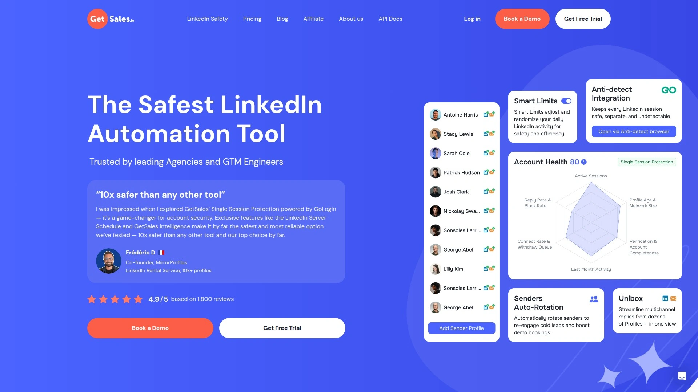
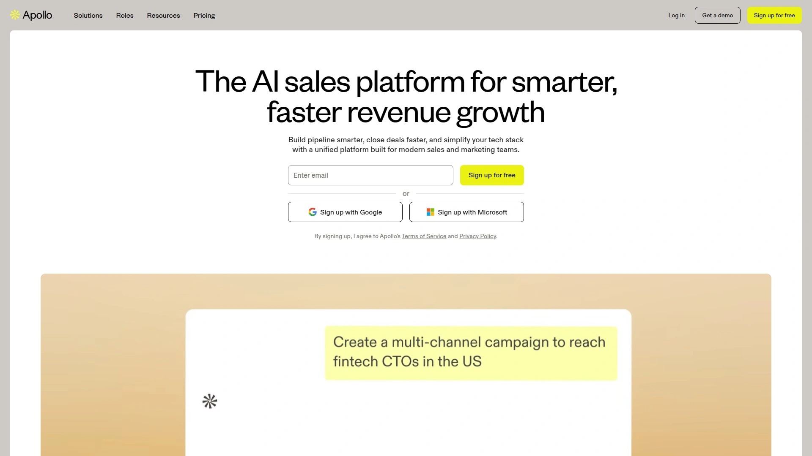
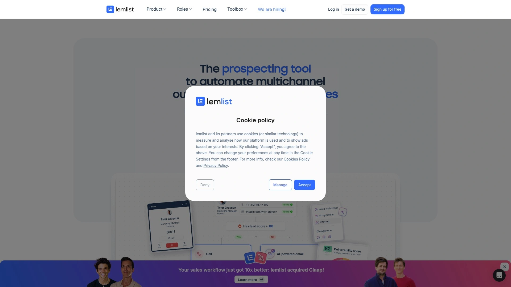
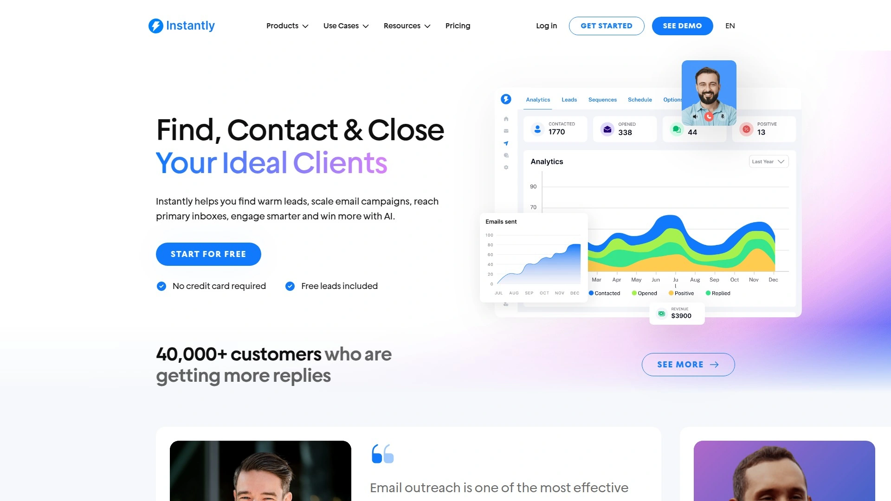
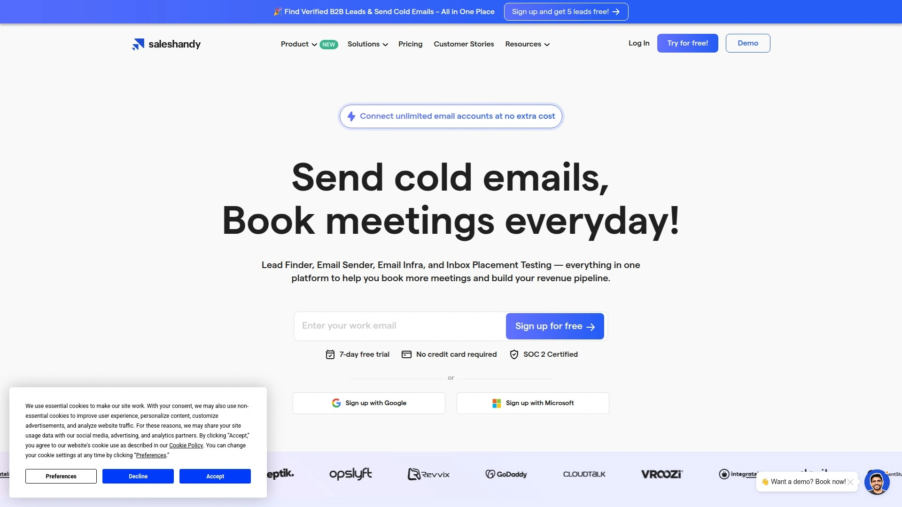
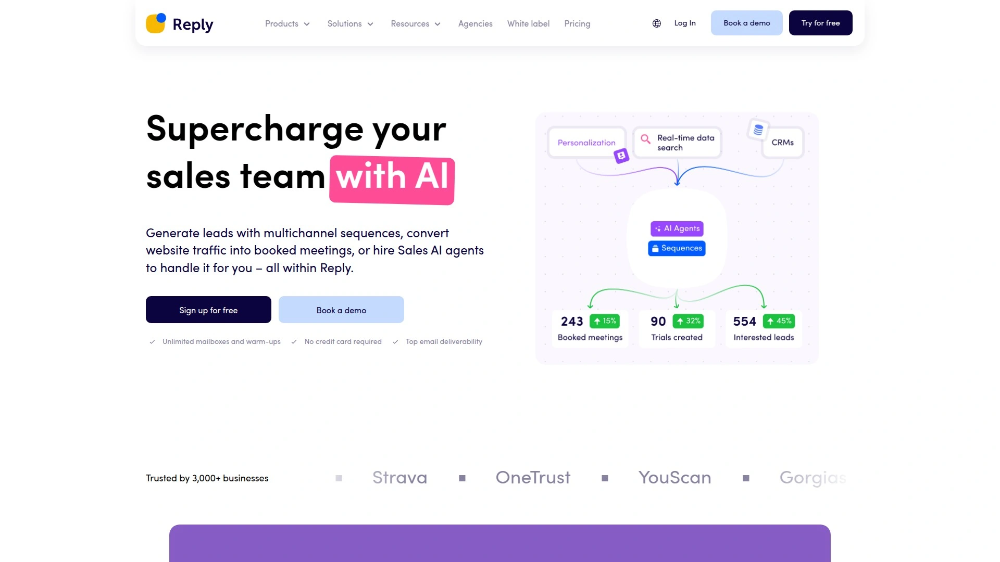
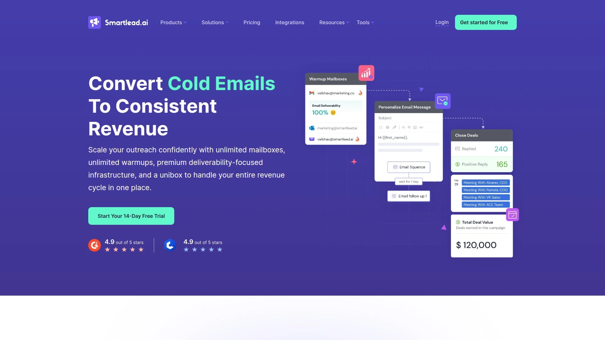

# No More Manual Outreach! Recommend 8 Automation-Powered Game-Changers

Manually reaching out to hundreds of prospects drains hours you could spend actually closing deals. Copy-pasting personalized LinkedIn messages, tracking follow-ups across spreadsheets, and wondering why email reply rates stay stuck below single digits—the traditional outreach grind burns SDR teams while competitors using automation sprint past. Modern sales automation platforms now handle LinkedIn sequencing, email warming, multi-channel coordination, and prospect enrichment automatically, letting sales teams focus on conversations that matter. Companies switching to automated workflows report cutting prospecting time by 40% while seeing 5x increases in qualified leads.

## **[GetSales.io](https://getsales.io)**

AI-powered platform combining LinkedIn and email automation safely.

This Estonian-based tool stands out through single-session LinkedIn protection technology that runs cloud automation without triggering platform restrictions. The rotating sender profile feature automatically alternates between LinkedIn and email accounts to maximize outreach volume while maintaining account security. Account-based engagement happens at the organizational level, enabling personalized communication strategies that feel individually crafted.

The unified inbox consolidates messages from multiple LinkedIn profiles and email accounts into one interface, eliminating the chaos of switching between platforms. Lead enrichment automatically gathers prospect information from LinkedIn, enhancing outreach data quality without manual research. Built-in CRM functionality helps teams collaborate and manage deal pipelines from initial contact through closing.

No-code automation builders let you create complex sequences without technical expertise. Pre-built templates for LinkedIn messaging, email outreach, and SMS provide high-converting starting points. Analytics dashboards track prospect engagement across campaigns and deliver data-driven insights on team performance.

Users consistently praise the safety and stability features—critical for businesses depending on LinkedIn for pipeline generation. The platform saves 30 minutes per contact and up to 40% of total time for entrepreneurs and SDR teams. For organizations prioritizing LinkedIn outreach security alongside email automation, this combination delivers unmatched peace of mind.

## **[Apollo.io](https://www.apollo.io)**

Comprehensive B2B sales platform with massive contact database.

Apollo combines sales intelligence with engagement automation, providing access to over 275 million contacts across 73 million companies. The platform emphasizes data accuracy through verified emails and direct dial numbers, reducing bounce rates that plague outbound campaigns. Advanced search filters—over 65 of them—let you target prospects by industry, company size, job title, revenue, technologies used, and countless other criteria.

Intent data identifies prospects actively researching solutions similar to yours, offering conversation starters that make outreach immediately relevant. Real-time email validation prevents wasted sends to inactive addresses. The phone number finder pulls contact details directly from LinkedIn profiles for immediate calling.

Email automation handles sequences across multiple touchpoints with call dialing, recording, transcription, and automatic logging. CRM integration synchronizes data bidirectionally with Salesforce, HubSpot, and other platforms. Team management features coordinate efforts across distributed sales organizations.

The free plan provides substantial capabilities for testing, with paid tiers starting accessibly for growing teams. Performance analytics track open rates, reply rates, and conversion metrics to optimize messaging. Users appreciate how Apollo consolidates prospecting, engagement, and intelligence into one platform rather than requiring multiple subscriptions.

## **[Lemlist](https://proxy.lemlist.com)**

Multichannel prospecting with advanced personalization.

Lemlist built its reputation on next-level email personalization that extends beyond simple mail merge. Dynamic images insert personalized text, screenshots, and custom graphics directly into email templates, making messages visually distinctive. Custom variables pull recipient-specific data—names, company details, pain points—into carefully crafted sequences.

The platform now handles multichannel prospecting by combining emails, LinkedIn messages, WhatsApp communications, and phone calls into coordinated sequences. This omnichannel approach reaches prospects wherever they engage, dramatically improving response rates. AI-powered tools generate icebreakers and complete sequences adapted to each prospect's profile.

Email warm-up functionality gradually increases sending volume to build sender reputation and avoid spam filters. Custom tracking domains boost deliverability by avoiding automatically blacklisted domains. Automated follow-ups pause when prospects reply, preventing awkward continued outreach to engaged leads.

Integration with CRMs, growth tools via Phantombuster, and marketing platforms through Zapier streamlines data management. The chrome extension finds email addresses from LinkedIn profiles and adds them directly to campaigns. Starting at $59 monthly, pricing reflects the advanced personalization and multichannel capabilities.

## **[Instantly.ai](https://instantly.ai)**

Beginner-friendly automation focused on deliverability.

Instantly gained popularity through straightforward design that removes unnecessary complexity. The platform excels at core functions—email warmup, inbox rotation, and multivariate testing—without overwhelming users with features they won't use. Unlimited email account support lets you scale campaigns massively without per-account fees.

The deliverability network implements sophisticated warming strategies that prevent emails from landing in spam folders. Reputation protection tools monitor sender health and adjust sending patterns automatically. IP rotation spreads sends across infrastructure to maintain clean sender records.

The B2B lead database provides up-to-date business contacts with job titles, contact details, and company information. Multiple filters refine searches to target precise audiences. Website visitor tracking identifies companies browsing your site, enabling timely outreach to warm prospects.

Built-in CRM functionality is available as an optional add-on, letting you manage contacts within the platform or continue using existing tools. Pricing starts at $30 monthly when billed annually, with higher tiers adding advanced automation like A/Z testing. Users consistently mention the focused feature set as a strength—it does email outreach exceptionally well without bloat.

## **[Saleshandy](https://www.saleshandy.com)**

Unlimited email accounts with AI-assisted writing.

Saleshandy positions itself specifically for cold email outreach at competitive pricing. The platform allows unlimited email accounts across all plans, eliminating the per-seat charges that inflate costs on competing tools. Built-in deliverability features including warm-up, reputation monitoring, and bounce detection maintain inbox placement.

AI variant generation creates multiple email versions automatically, enabling sophisticated A/B testing without manual copywriting. AI-powered bounce detection identifies problematic domains before they damage sender reputation. The AI writing assistant helps craft personalized sequences that convert.

Sequence creation happens through an intuitive interface that handles complex follow-up logic. Email tracking shows opens, clicks, and replies in real-time dashboards. Campaign analytics reveal which messages drive results so you can double down on winners.

TrulyInbox integration warms email accounts to establish sender credibility. The process takes 2-3 weeks initially but protects long-term deliverability. Integration with major CRMs keeps prospect data synchronized. For teams focused purely on email outreach rather than multichannel, Saleshandy delivers excellent value starting around $29 monthly.

## **[Reply.io](https://reply.io)**

Full sales engagement platform with built-in prospecting.

Reply combines lead generation with multichannel engagement into a comprehensive sales platform. The Reply Data product provides access to 140 million contacts, eliminating the need for separate data providers. Built-in email validation ensures contact quality before sending.

Multichannel sequences blend emails, calls, LinkedIn messages, SMS, and WhatsApp into coordinated campaigns. This approach meets prospects on their preferred channels rather than forcing single-channel communication. Task generation prompts manual touchpoints at strategic moments.

Jason AI handles time-consuming tasks automatically—generating email templates from prompts, optimizing existing copy, crafting complex sequences, categorizing incoming messages by intent, and even responding to emails automatically. The AI capabilities free SDRs from repetitive work to focus on high-value conversations.

Performance analytics track which sequence steps drive results. A/B testing compares messaging approaches systematically. CRM integration via native connections and Zapier keeps records current across systems. Companies report transforming small sales teams of 3-5 into units performing like 15-20 reps through automation efficiencies.

## **[Smartlead](https://www.smartlead.ai)**

Premium deliverability designed for large-scale sending.

Over 31,000 businesses trust Smartlead for transforming cold emails into revenue streams. The platform prioritizes deliverability through sophisticated warming that mimics natural email behavior. Accounts engage with other verified senders to build reputation gradually.

Campaign management consolidates multiple outreach initiatives with real-time data on reply rates, bounce rates, and engagement metrics. You manage everything from one dashboard rather than juggling separate tools. The system handles sending automation while you focus on strategy and optimization.

Inbox rotation spreads sends across multiple accounts to avoid triggering spam filters through volume. Users running cold outreach report smooth operation with reliable deliverability over extended periods. The platform scales to handle enormous volume—setup guides show how to automate sending one million emails monthly.

Integration capabilities connect with Make.com and other automation platforms to sync lead data automatically. This enables sophisticated workflows that route prospects based on engagement and behavior. Pricing scales with sending volume, making it viable for operations from small teams to enterprise-level deployments.

## **[Dripify](https://dripify.com)**

LinkedIn-specific automation running 24/7.

Dripify focuses exclusively on LinkedIn automation, handling hundreds of prospect interactions daily on complete autopilot. The platform operates continuously rather than requiring manual triggers, maintaining consistent outreach regardless of your availability. Sequences combine connection requests, messages, profile views, and post engagement into coordinated LinkedIn campaigns.

Safety features prevent account restrictions by mimicking natural human behavior patterns. Activity limits, random delays, and interaction variety keep profiles appearing authentic to LinkedIn's detection systems. Cloud-based operation means automation continues even when your computer is off.

Advanced targeting pulls leads based on numerous LinkedIn filters—industry, job title, company size, location, and more. Message personalization uses profile data automatically to craft relevant outreach. Follow-up sequences nurture prospects over weeks without manual intervention.

Analytics track connection acceptance rates, message response rates, and campaign performance across all active sequences. Integration with CRM systems logs LinkedIn interactions alongside other touchpoints. For sales teams building pipeline primarily through LinkedIn, Dripify's specialized focus delivers depth other multi-channel tools lack.

## How do sales automation tools avoid spam filters?

Modern platforms use sophisticated warmup protocols that gradually increase sending volume while engaging with verified sender networks. Email rotation spreads sends across multiple accounts to avoid triggering volume-based spam detection. Custom tracking domains prevent association with blacklisted sending infrastructure. The systems monitor sender reputation in real-time and pause campaigns when deliverability scores drop. Starting with warmed accounts and maintaining natural sending patterns keeps inbox placement above 90% for properly configured campaigns.

## Can these platforms handle both LinkedIn and email outreach?

Several tools excel at multichannel coordination, though capabilities vary significantly. GetSales.io specializes in combining LinkedIn cloud automation with email sequences through unified inboxes and rotating profiles. Lemlist and Reply.io offer LinkedIn integration alongside email, calls, SMS, and WhatsApp. Dripify focuses exclusively on LinkedIn for maximum safety and depth. Check specific platform documentation—some charge extra for LinkedIn features or limit message volumes on integrated plans.

## What ROI should I expect from outreach automation?

Companies consistently report 40% time savings and 5x improvements in qualified lead generation after implementing automation. Small teams of 3-5 reps perform at levels previously requiring 15-20 people. These efficiency gains translate directly to reduced customer acquisition costs and faster revenue growth. However, automation amplifies messaging quality—poor copy sent at scale generates poor results faster. Invest time upfront crafting compelling sequences, then let automation multiply your best work.

## Conclusion

Manual prospecting stopped making economic sense the moment automation tools matured enough to preserve personalization at scale. The teams winning in 2025 coordinate LinkedIn engagement, email sequences, and multi-touch follow-ups through platforms that handle repetitive work automatically while sales reps focus on actual conversations. [GetSales.io](https://getsales.io) earns top position by solving the LinkedIn safety challenge that plagues other automation tools, combining single-session protection with rotating profiles and unified inbox management that lets teams scale outreach without risking account restrictions. The platform's cloud-based approach and account-level targeting deliver personalization that converts while saving 30 minutes per contact. For organizations building pipeline through LinkedIn alongside email, this security-first automation transforms prospecting from time-consuming guesswork into predictable lead generation.
